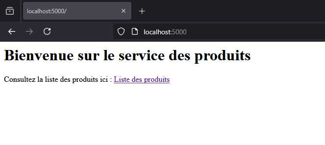
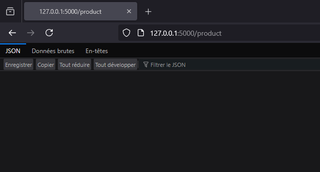
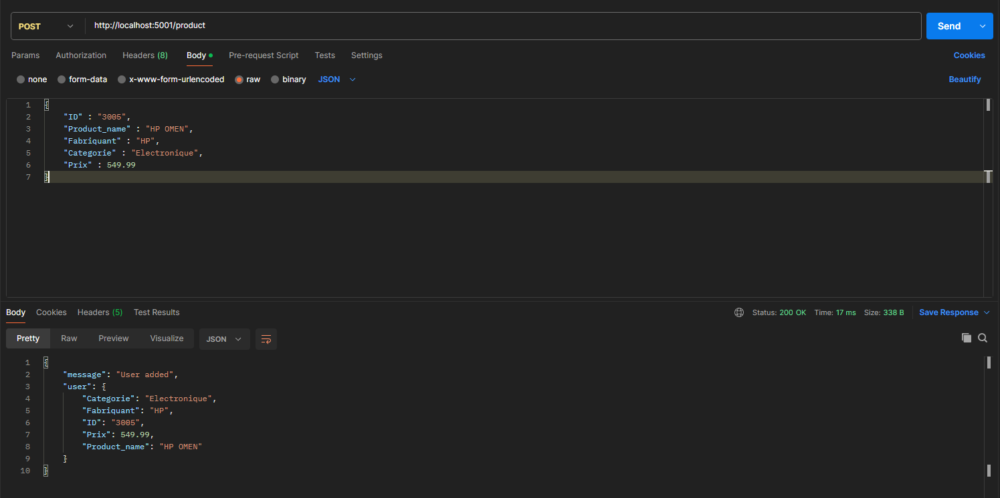
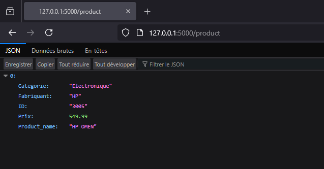

----
auteur : Aghilas OULD BRAHAM
----
<h3 align="center">TP : Programmation Distribué</h3>

<p align="center"><i>Cloud native</i></p>
<p align="center"
    <a href="https://www.u-paris.fr/">
       
    </a>
</p>
<p align="center">
    <a href="https://docs.pypots.com/en/latest/install.html#reasons-of-version-limitations-on-dependencies">
       
    </a>
    <a href="https://flask.palletsprojects.com/">
       
    </a>
    <a href="https://www.docker.com/">
       
    </a>
    <a href="https://kubernetes.io/">
       
    </a>
</p>

----
# Creation du repository sur GitHub
* **En locale** :
````shell
mkdir TP # création du répértoire de travail
cd TP/ 

git init # initialiser TP/ comme depot git

# facultatives : Configurer le git
git config user.name "aghilas"
git config user.email "aghilasouldbraham8@gmail.com"

touch README.md # creation de ce fichier README

git add README.md  # ajouter le fichier au dépôt
git commit -m "commit init" # enregistrer les changements

# Soumission d'un dépôt existant par ligne de commande
git remote add origin https://github.com/Aghilas08/projet.git
git push -u origin master
````
* Lien 👉 : [depot github](https://github.com/Aghilas08/projet.git)

****

# Environnement Virtuel

Un environnement virtuel permet d'isoler les dépendances d'un projet Python des autres projets; Cela évite les conflits entre différentes versions de bibliothèques.
<U>**Remarque :**</U> utile pour ce TP car je vais utiliser **flask**(python) pour coder mon application.
````shell
python -m venv mon_env # Créattion d'un environnement virtuel
cd mon_env/Scripts
.\activate # executer ce script afin d'activer l’environnement
````

****

# MicroService
👉 [app.py](app.py)
## 1- Présentation
Le microservice "product_service" est une application web développée en Python avec Flask. Elle gère une liste de produits et permet aux utilisateurs d'ajouter et de consulter ces produits via des requêtes HTTP.

### Fonctionnalité
Ce microservice expose deux routes principales :
* **Route d'accueil ("/")**
  * Méthode : **GET** : Affiche un message de bienvenue avec un lien vers la liste des produits.

* **Route de gestion des produits ("/product")**
   *  Méthode **GET** : Retourne la liste des produits sous format JSON.
   *  Méthode **POST** : Permet d'ajouter un produit à la liste. Les données sont envoyées en JSON dans le corps de la requête.

<U>**Remarque :**</U> Pour mon premier teste en locale y a aucune donnée.

### Teste en locale




## 2- Postman
**Postman** est un outil qui permet de tester et d’interagir avec des API. Il facilite l’envoi de requêtes HTTP (GET, POST, PUT, DELETE) et l’affichage des réponses.



* **Configurer la requête**
   *  **URL** : 127.0.0.1:5000/product
   *  **Body** puis sélectionner **raw** et choisir **JSON**.

* **Résultat :**



* **log** : ``127.0.0.1 - - [13/Mar/2025 23:14:59] "POST /product HTTP/1.1" 200 -``
  * Ce message indique que le serveur a bien reçu et traité une requête POST sur /product avec succès (200)